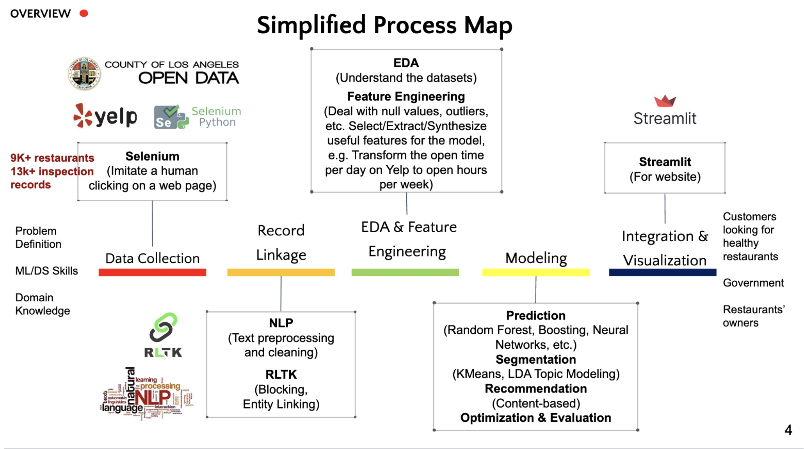
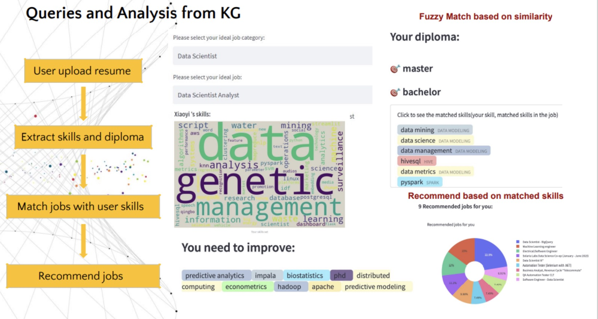

# Data Scientist

#### Technical Skills: Python, SQL, PySpark, Linux, AWS, Databricks, PyTorch, TensorFlow, MapReduce, SageMaker, Git, Neo4j, A/B Testing, ETL

## Education
- M.S., Applied Data Science | University of Southern California, Los Angeles, CA, U.S. (_Dec 2023_)					  
- B.S., Information Management and Information Systems | Beijing Foreign Studies University, Beijing, China (_Jun 2021_)

## Work Experience
**Machine Learning Research Intern @ SylphAI Inc. (_Sep 2023 - Present_)**
- Optimize SylphAI **recommendation system** matching goals and candidates leveraging **GPT-4**. Define dataset scopes, training strategies and evaluation metrics and sampled 4000 records. Build Reasoning and Rating GPT to enhance retriever and ranker. 
- Apply Self-instruct pipeline with prompt engineering to generate data, reducing manual cost by 50%. Creatively boost retriever efficiency using knowledge distillation. Tune instructions and increase model accuracy by 15%.

**Data Scientist Intern @ Adobe Inc. (_May 2023 – Aug 2023_)**
- Evaluated the success of a product recommendation strategy by calculating pre-launch and post-launch conversion, cancellation, engagement, retention, and customer LTV metrics. Designed visualizations on 1M+ records to identify products with negative incremental profits (Matplotlib & Plotly). Drove collaboration with cross-functional teams.
- Optimized product strategy using **Regression models with feature preprocessing** to find significant factors leading to cancellation. Clustered customers to identify cohorts canceling subscriptions and applied detected patterns to improve retention by 13%. Manipulated data on Databricks with complex **SQL** queries and **Python**.
- Utilized **NLP** to identify cancellation reasons, applying spaCy to understand product problems to enhance user journey.
- Packaged insights and leveraged data storytelling to deliver recommendations to senior leaders and stakeholders. Predicted a 10% conversion rate improvement and an up to $8.3M annual recurring revenue (ARR) Lift per quarter.
- 

**Data Scientist & Machine Learning Research Intern @ HireBeat Inc. (_May 2022 – Jul 2022_)**
- Led a project establishing **data metrics dashboard** and devised a UI connected with **PostgreSQL (Python & Streamlit)**, empowering users to interact with backend database using filters and reducing manual costs by 30%.
- Developed an **end-to-end pipeline** for classifying resumes into multiple job categories. Vectorized text features with TF-IDF, constructed SVM and Neural Networks models, performed hyper-parameter tuning and boosted accuracy by 15% compared with KNN (baseline). Deployed these models to recommend targeted job categories and improved users’ job application process and satisfaction. Performed clustering analysis to compare premium and free trial account features for marketing promotion.

**Data Analyst Intern @ Beijing Qingbo Big Data Technology Co., Ltd. (_Jun 2021 – Sep 2021_)**
- Leveraged **Selenium/Scrapy crawlers** to acquire 5K+ posts from social media platforms with hot issue keywords, applied text mining and pre-trained models from Hugging Face for sentiment and statistical analysis and visualized results.

## Projects
### Draft-Based DOTA2 Winning Camp Prediction
[Article](https://medium.com/@xiaoyigu/data-science-for-dota2-part-1-data-collection-55d7d7cb07c1)
- Predicted the winning camps of the video game DOTA2 with 16K+ matches crawled by Selenium and Scrapy.
- Researched on DOTA2 winning prediction papers and applied **HIN2Vec graph embedding** to transform the hero relationships into features. Conducted feature engineering and built a set of predictors such as XGBoost (F1 Score 0.64).

### Los Angeles Restaurant Heath Inspection and Recommendation
[Video](https://www.youtube.com/watch?v=oiM0AO_HvLQ)
- Led a team as the **Project Manager**. Developed a system identifying risky restaurants collaborating closely with stakeholders using **Agile**. Crawled 9K+ restaurants from Yelp, and applied Record Linkage to integrate Yelp records with LA Open Data.
- Established **risk predicting models (SVM/Random Forest/XGBoost)** with 84% accuracy and 0.7 roc_auc, applied clustering models (PCA/KMeans) and topic modeling to find insights from restaurant groups and Yelp reviews.
- Designed a content-based restaurant recommender. Explored a weighted model with Collaborative Filtering and XGBoost and researched Graph embedding for recommendation on the Yelp dataset with 0.977 RMSE.

### Job Recommendation System Based on Knowledge Graph
[Video](https://www.youtube.com/watch?v=EczX-wm0GMc)
- Extracted required skills and diplomas from 10K+ job descriptions with spaCy and fine-tuned BERT models (F1 score 0.66/0.88), applied **entity resolution** to establish a knowledge graph connected with Neo4j. Applied TF-IDF to vectorize features and constructed job category classifiers to classify each job into 15 categories.
- **Deployed web application** with Knowledge Graph to facilitate job search and visualize matched skills in resumes and users’ ideal positions. Utilized similarity metrics to recommend jobs and suggest skills for users to improve.

## Hobbies: Data Science, Detective Fiction, DOTA2
